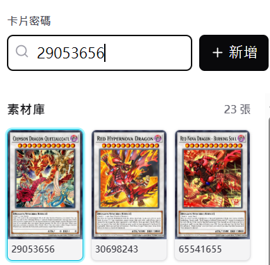

# YGO Combo Maker

A browser-based tool for building and exporting clear Yu-Gi-Oh! combo flowcharts. Projects are saved automatically in your browser.

## How to Use

1. Enter a card passcode to add a card to the shared library. Card passcodes can be found on databases such as [XPG Cards](https://asia.xpg.cards/).

   

2. Click a library card to select it, then click a slot on the canvas. You can also drag cards directly into slots.

   

3. The canvas follows a fixed snake-shaped reading order. Each step contains a main card, supporting material cards, and an optional chain column.

4. Right-click a main card to insert, clear, or delete steps. Right-click material and chain slots to manage their contents.

   

   

   

5. Use **Settings** to change the row size and card size, import or export JSON, and export the finished flowchart as a PNG.

   

6. Open **Flow Manager** to create, switch, duplicate, rename, or delete flowcharts. The card library is shared across all flowcharts.

   

## License

This project is licensed under the [MIT License](https://opensource.org/licenses/MIT). You may use, modify, and distribute it in accordance with the license terms.
